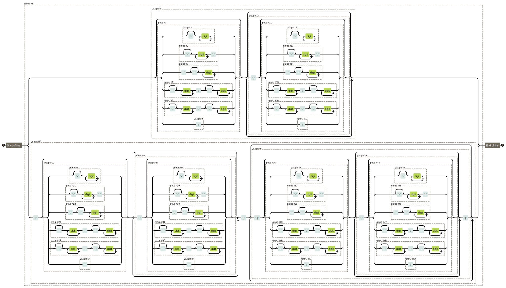

Int/Int-seq Filter
==================

Filter integers or integer sequences as per numpy-like advanced indexing.

`ifilters` provides predicate class that produces predicator according to
the provided numpy-like advanced indexing pattern. For example,

- `1-2`: \{1, 2\}
- `-1--2`: \{\}
- `-2--1`: \{-2, -1\}
- `1,3`: \{1, 3\}
- `1:5`: \{1, 2, 3, 4\}
- `1,3,7:`: \{1, 3\} \cup \{x \mid x \ge 7\}
- `[2],[3-5]`: \{(2,x) \mid 3 \le x \le 5\}

Pattern specification
---------------------

Two types of patterns are acceptable: 1) *integer pattern* and 2) *integer
sequence pattern*. Integer pattern consists of a comma-separated list of
zero or more *atomic patterns*. If it contains no atomic pattern, it's called
an *nil pattern*. Nil pattern matches nothing. An integer pattern may or may
not be enclosed in square bracket. An integer pattern expects either an integer
or a singleton sequence of integers -- sequence that contains only one integer.
An integer sequence pattern consists of a comma-separated list of square
bracket enclosed integer patterns.

There are six different atomic patterns: a) single, b) prefix, c) suffix,
d) inclusive range, e) exclusive range and f) all. The regex each atomic
pattern should match against is shown below:

- single: `^-?[0-9]+$`
- prefix: `^:-?[0-9]+`
- suffix: `^-?[0-9]+:`
- inclusive range: `^-?[0-9]+--?[0-9]+$`
- exclusive range: `^-?[0-9]+:-?[0-9]+$`
- all: `:`

An atomic single matches the exact integer. An atomic prefix matches all
integers smaller than the referential integer. An atomic suffix matches all
integers greater than or equal to the referential integer. An atomic inclusive
range matches all integers within range :math:`[a, b]`. An atomic exclusive
range matches all integers within range :math:`[a, b)`. An atomic all matches
all integers.

Overview of the syntax (thanks [REGEXPER](https://regexper.com/)):




Example Usage
-------------

```python
from ifilters import IntSeqPredicate
list(filter(IntSeqPredicate('4-10'), range(8)))
# --> [4, 5, 6, 7]
list(filter(IntSeqPredicate('[-3],[:]'), [(x, 4) for x in range(-5, 1)]))
# --> [(-3, 1)]

IntSeqPredicate('4,5,7,9,2-5,-3-0')  # DNF in __repr__
# --> IntSeqPredicate({[-3,1) U [2,6) U [7,8) U [9,10)}_0)

isp = IntSeqPredicate('4,5,7')  # predicate integers
assert isp(7)
assert not isp(8)

isp = IntSeqPredicate('[:],[3]')  # predicate int-sequences
assert isp((4, 3))
assert isp([4, 3])

assert IntSeqPredicate('0')  # matching something (only zero here)
assert not IntSeqPredicate('')  # not matching any integers

assert IntSeqPredicate('7:2') == IntSeqPredicate('')  # {x|7<=x<2} is empty
assert IntSeqPredicate('4') == IntSeqPredicate('4:5,7-1')
```

Attached convenient iterator to traverse the set implied by an `IntSeqPredicate`: `IntSeqIter`.

> Copied from help(IntSeqIter)

```
class IntSeqIter(builtins.object)
 |  Make int/int-seq iterator from predicate implying a upper- and
 |  lower-bounded finite set of integers or integer sequences.
 |  
 |  >>> list(IntSeqIter('3-4,7-10', use_int_if_possible=True))
 |  [3, 4, 7, 8, 9, 10]
 |  >>> list(IntSeqIter('3-4,6'))
 |  [(3,), (4,), (6,)]
 |  >>> list(IntSeqIter(''))
 |  []
 |  
 |  Methods defined here:
 |  
 |  __init__(self, predicate:Union[str, ifilters.ifilters.IntSeqPredicate], use_int_if_possible:bool=False)
 |      :param predicate: the predicate object or predication expression
 |      :param use_int_if_possible: if ``predicate`` implies a one dimension
 |             int-sequence pattern, let ``__iter__`` returns an iterator
 |             of ``int`` rather than an iterator of singleton ``int tuple``s.
 |      :raise UnboundedPredicateError: if ``predicate`` implies unbounded
 |             language
 |  
 |  __iter__(self)
```

Installation
------------

This package requires `Python 3.5` or above.


```bash
pip install ifilters
```

Mechanism
---------

Given a pattern `[C1,C2,C3,...,Cn],...`, where `Ci` is one of the atomic patterns described above,
and given an integer `x`, instead of making comparison test against each `Ci` sequentially,
the `ifilters` module first reduces the `n` patterns into `k (k<=n)` non-empty and disjoint ranges.
Then a binary search is performed along the sorted list of range endpoints.
Assuming that a `predicate` is only built once and is used to match many integer/integer sequences afterwards,
the overall time complexity would be much smaller than a simple comparison strategy.


Related command line tool
=========================

The sub-project of this repo: [range2nums](https://github.com/kkew3/range2nums.git)
